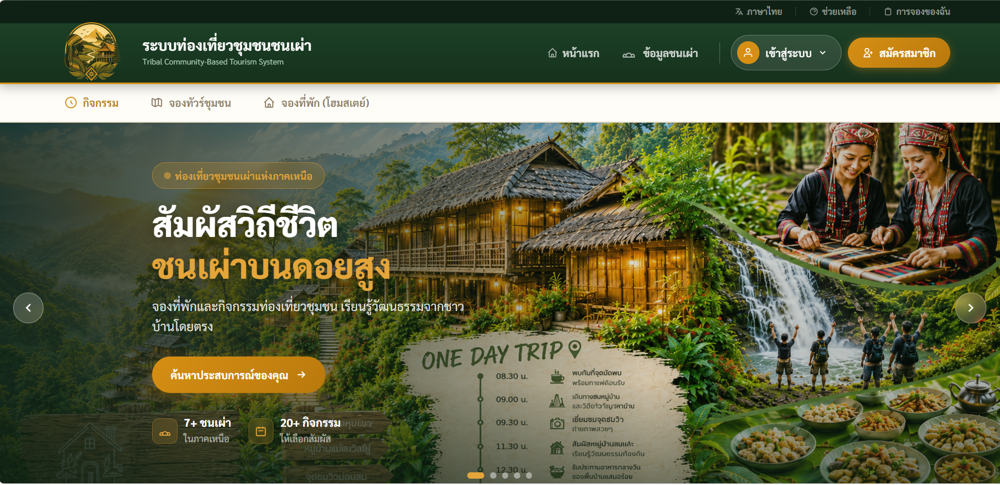

<!-- Banner / Cover -->

  

<!-- Introduction -->
<h1 align="center">
  Hi, I'm Bongkoch! 👋
</h1>

  <strong>Information Technology Student • Frontend Developer</strong> 
  <em>“💗 Passionate about building user-friendly web applications.”</em>

---
## 🚀 About Me

I'm a fourth-year Information Technology student at Maejo University with a strong interest in Frontend Development. I enjoy creating user-friendly web applications and applying my technical knowledge through academic projects.

- 💻 Passionate about Frontend Development and modern web technologies
- 🎨 Enjoy creating clean and intuitive user interfaces
- 🤝 Enjoy collaborating with others and solving real-world problems
- 🌱 Continuously learning and improving my programming skills
- 📫 Reach me: **gmolbkoe47@gmail.com**

📍 **Current Project:** Developing a **Tribal Community Tourism System**, a web application that promotes tribal community tourism by providing information about tours, homestays, and community activities.

---

## 🧰 Tech Stack & Tools

<table>
  <tr>
    <th style="padding:12px; font-size:18px;">🌿 Category</th>
    <th style="padding:12px; font-size:18px;">💻 Technologies</th>
  </tr>
  <tr>
    <td style="padding:14px; font-size:16px;">🩷 <b>Front-end</b></td>
    <td style="padding:14px;">
      
      
      
      
    </td>
  </tr>
  <tr>
    <td style="padding:14px; font-size:16px;">💚 <b>Back-end</b></td>
    <td style="padding:14px;">
      
      
    </td>
  </tr>
  <tr>
    <td style="padding:14px; font-size:16px;">💙 <b>Database</b></td>
    <td style="padding:14px;">
      
    </td>
  </tr>
  <tr>
    <td style="padding:14px; font-size:16px;">🩶 <b>Tools</b></td>
    <td style="padding:14px;">
      
      
      
    </td>
  </tr>
</table>

---
## 🚀 Featured Projects

<table>
<tr>

<td width="45%" align="center">

<h3>🌿 Tribal Community Tourism System</h3>

<b>Main Project • 2025</b> 
👥 <b>Team Project (2 Members)</b>

  

<h3>🛠️ Technologies Used</h3>

 

🔗 <b>Repository</b>

</td>

<td width="55%">

<h2>✨ Key Features</h2>

<h3>🏡 Community Tourism</h3>

<ul>
<li>Explore tribal community tourism destinations and local cultural experiences</li>
<li>Browse tours and homestays with detailed information</li>
<li>Discover traditional activities offered by local communities</li>
</ul>

<h3>📅 Booking System</h3>

<ul>
<li>Reserve tours and homestays online</li>
<li>Upload payment slips for booking confirmation</li>
<li>Track booking status and view reservation details</li>
<li>View available tour schedules</li>
</ul>

<h3>👥 Role-Based Management</h3>

<ul>
<li><b>Tourist:</b> Browse destinations, make reservations, upload payment slips, and submit reviews</li>
<li><b>Community Manager:</b> Manage tours, schedules, and customer bookings</li>
<li><b>Homestay Owner:</b> Manage homestay information, room availability, and reservations</li>
<li><b>Administrator:</b> Create Community Manager accounts and approve Homestay Owner registrations</li>
</ul>

<h3>⭐ Additional Features</h3>

<ul>
<li>Review and rating system</li>
<li>Tour schedule management</li>
<li>Booking history and reservation tracking</li>
</ul>

</td>

</tr>
</table>

---

<table>
<tr>

<td width="45%" align="center">

<h3>🌄 Chiang Mai Tourism Booking System</h3>

<b>Academic Project • 2025</b> 
👥 <b>Team Project (2 Members)</b>

  

<h3>🛠️ Technologies Used</h3>

 

🔗 <b>Repository</b>

</td>

<td width="55%">

<h2>✨ Key Features</h2>

<h3>🎯 Tourism Activities</h3>

<ul>
<li>Browse available tourism activities in Chiang Mai.</li>
<li>View activity details, schedules, and pricing.</li>
<li>Explore activity information before making a reservation.</li>
</ul>

<h3>📅 Booking System</h3>

<ul>
<li>Book tourism activities online.</li>
<li>Upload payment slips for booking confirmation.</li>
<li>Track booking status and view reservation details.</li>
<li>Access booking history.</li>
</ul>

<h3>👥 User Management</h3>

<ul>
<li><b>Tourist:</b> Register, browse activities, make bookings, upload payment slips, and manage reservations.</li>
<li><b>Administrator:</b> Manage tourism activities, verify payment slips, approve bookings.</li>
</ul>

<h3>⭐ Additional Features</h3>

<ul>
<li>Activity schedule management.</li>
<li>Payment approval workflow.</li>
<li>Booking history tracking.</li>

</ul>

</td>

</tr>
</table>

## ✍🏻 Recent Blog / Talks
<!-- GH Action can automate this section; placeholder for manual list -->
- ⟪May 2025⟫ • **Observable-Ready Dashboards** at BangkokJS  
- ⟪Apr 2025⟫ • Published *“Scalable Monorepo Patterns”* on Medium  
- ⟪Mar 2025⟫ • Panel speaker at DevCon Asia: *Modern DevOps*

---

## 📊 GitHub Stats

  

  

------

# 🤍 Let's Connect

### ✨ Open to collaboration & new opportunities

 

---
