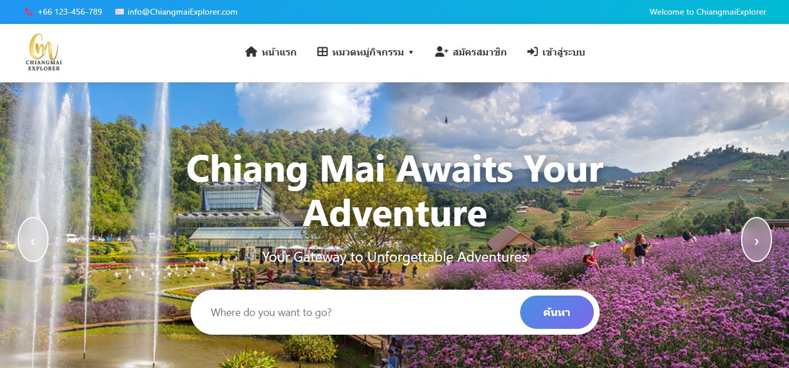

<!-- Banner / Cover -->

  

  <em>
    💗 Passionate about creating user-friendly, visually appealing, and intuitive digital experiences.
  </em>

---

## 🎨 About Me

I'm a fourth-year Information Technology student at Maejo University with a strong interest in UX/UI Design and Front-end Development. I enjoy designing clean, intuitive, and user-friendly interfaces while applying my technical knowledge to bring designs to life through web development.

- 🎨 Interested in UX/UI Design and creating user-friendly interfaces
- 🖌️ Enjoy designing website layouts, visual elements, and intuitive user experiences
- 💻 Familiar with HTML, CSS, JavaScript, and web application development
- 🧩 Interested in wireframing, user flow, and improving website usability
- 🤖 Leverage AI tools to support design ideation and prototyping
- 🤝 Enjoy collaborating with others and solving design and development problems
- 🌱 Continuously learning and improving my design and web development skills
- 📫 Reach me: **gmolbkoe47@gmail.com**

📍 **Current Project:** Developing a **Tribal Community Tourism System**, a web-based platform that provides information about tours, homestays, bookings, and payment management, with a focus on creating a clear and user-friendly interface.

---

## 🎨 UX/UI Design Skills

---

## 🧳 Tech Stack & Tools

<table>
  <tr>
    <th>Domain</th>
    <th>Primary</th>
    <th>Currently Exploring</th>
  </tr>

  <tr>
    <td><b>🎨 Design</b></td>
    <td>
      
      
    </td>
    <td>
      
    </td>
  </tr>

  <tr>
    <td><b>💻 Front-end</b></td>
    <td>
      
      
      
      
    </td>
    <td>
      
    </td>
  </tr>

  <tr>
    <td><b>⚙️ Back-end</b></td>
    <td>
      
      
      
    </td>
    <td></td>
  </tr>

  <tr>
    <td><b>🗄️ Database</b></td>
    <td>
      
      
    </td>
    <td></td>
  </tr>

  <tr>
    <td><b>🛠️ Tools</b></td>
    <td>
      
      
      
    </td>
    <td></td>
  </tr>

  <tr>
    <td><b>🤖 AI Tools</b></td>
    <td>
      
      
      
    </td>
    <td></td>
  </tr>

</table>

---
## 🚀 Featured Projects

<table>
<tr>

<td width="50%" align="center">

<h3>🌿 Tribal Community Tourism System</h3>

<b>Main Project • 2026</b> 
👥 <b>Team Project (2 Members)</b> 
💼 <b>My Role: Frontend & Backend Developer (Member & Administrator)</b>

  

<h3>🛠️ Technologies Used</h3>

 

🔗 <b>Links</b>

</td>

<td width="50%" valign="top">

<h2>✨ Key Features</h2>

<h3>🌿 Community Tourism</h3>

<ul>
<li>Explore tribal community tourism destinations and local cultural experiences.</li>
<li>Browse available tours and homestays with detailed information.</li>
<li>Discover traditional activities provided by local communities.</li>
</ul>

<h3>📅 Booking System</h3>

<ul>
<li>Reserve tours and homestays through an online booking system.</li>
<li>Upload payment slips for booking confirmation.</li>
<li>Track booking status and view reservation details.</li>
<li>View available tour schedules.</li>
</ul>

<h3>👥 Role-Based Management</h3>

<ul>
<li><b>Member:</b> Browse destinations, make reservations, upload payment slips, and submit reviews.</li>
<li><b>Community Manager:</b> Manage tours, schedules, and customer bookings.</li>
<li><b>Homestay Owner:</b> Manage homestay information, rooms, and reservations.</li>
<li><b>Administrator:</b> Manage users and approve registrations.</li>
</ul>

<h3>⭐ Additional Features</h3>

<ul>
<li>Review and rating system.</li>
<li>Tour schedule management.</li>
<li>Booking history tracking.</li>
</ul>

</td>

</tr>

<tr>

<td width="50%" align="center">

<h3>🌄 Chiang Mai Tourism Booking System</h3>

<b>Academic Project • 2025</b> 
👥 <b>Team Project (2 Members)</b> 
💼 <b>My Role: Frontend Developer (Booking & User Interface)</b>

  

<h3>🛠️ Technologies Used</h3>

 

🔗 <b>Links</b>

</td>

<td width="50%" valign="top">

<h2>✨ Key Features</h2>

<h3>🎯 Tourism Activities</h3>

<ul>
<li>Browse available tourism activities in Chiang Mai.</li>
<li>View activity details, schedules, and pricing.</li>
<li>Explore activity information before making a reservation.</li>
</ul>

<h3>📅 Booking System</h3>

<ul>
<li>Book tourism activities online.</li>
<li>Upload payment slips for booking confirmation.</li>
<li>Track booking status and reservation details.</li>
<li>Access booking history.</li>
</ul>

<h3>👥 User Management</h3>

<ul>
<li><b>Tourist:</b> Register, browse activities, make bookings, and manage reservations.</li>
<li><b>Administrator:</b> Manage tourism activities, verify payments, and approve bookings.</li>
</ul>

<h3>⭐ Additional Features</h3>

<ul>
<li>Activity schedule management.</li>
<li>Payment approval workflow.</li>
<li>Booking history tracking.</li>
</ul>

</td>

</tr>

</table>

---

## 📊 GitHub Stats

  

  

------

# 🤍 Let's Connect

### ✨ Open to collaboration & new opportunities

 

---
